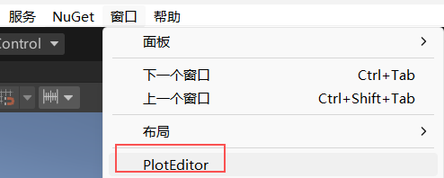
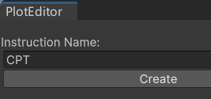
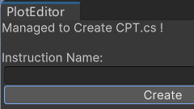
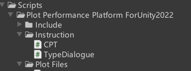
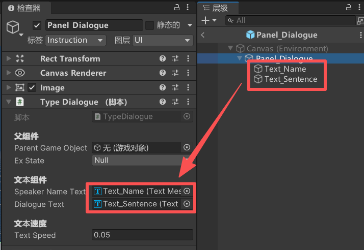

# **Plot Performance Platform For Unity 2022**

**GitHub页面**:[Avlorayne/Plot-Performance-Platform-ForUnity2022](https://github.com/Avlorayne/Plot-Performance-Platform-ForUnity2022)  
**GitHub仓库**：https://github.com/Avlorayne/Plot-Performance-Platform-ForUnity2022.git

## **1. 项目介绍**

### **1.1 基本介绍**

这是一个基于Unity的**剧情演出平台**，用于在游戏中演出复杂的剧情。

在此项目的视角中，游戏剧情被分为以下结构：

#### **1. 指令**
- 指令是剧情演出平台的**基本单位**，每一个指令对应一个具体的操作，例如显示对话、播放音效、改变角色状态等。

#### **2. 帧**
- 帧是**同一时间执行的指令集合**。同一次用户端输入，会触发一次帧的执行，此时帧中的所有指令会同时执行或按序列执行。

#### **3. 节**
- 不同的帧组成了一节，不同的节组成了一幕。在同一幕中，不同的节可以跳转，实现**不同的剧情分支**。

#### **4. 幕**
- 一个**完整的剧情**，作为一个完整的单位被保存在一个文件中。一个游戏可以有多个幕，但需要分为不同的文件被加载和管理。

### **1.2 功能简介**

#### **用户端**

用户端在触发演出总控器的开启条件时，总控器唤起到某一节，然后开始**逐帧进行剧情演出**。用户可通过鼠标点击或输入按键实现**跳过某帧**或**继续下一帧**，直至这一幕结束或获取到结束的指令。

#### **策划开发端（未实现）**

策划可在 Unity Editor 中的 **Plot Editor 窗口**中编辑剧情。窗口可实现：

1. 剧情序列的**保存和加载**；
2. **增删改**剧情序列中的指令和参数；
3. **实时编译**剧情序列；
4. **调试**剧情序列，加入运行断点和起始位，便于观测指令效果。

#### **程序开发端**

**程序的工作流**：

1. Unity Editor 中的 Plot Editor 窗口中**新建指令脚本**；
2. 自定义指令参数 `InstrParam` 和指令执行行为 `InstrExecute`；
3. 创建指令执行的预制体，将预制体的Tag设为 `Instruction` 将指令脚本配置在预制体中，并配置脚本所需的组件资源。

### **1.3 运行原理**

#### **用户端运行流**

1. **开始**：Plot Perform Sys在游戏开始时就加载文件中的剧情指令，通过**反序列化**加载在Frame List中。

2. **初始化**：Frame List再构造Frame Ex List生成实际执行的执行序列：
    - **实例化**所需的执行资源（指令预制体）；
    - **分配**每一个指令执行对应的执行资源（指令预制体）；
    - 每一帧根据所包含的指令控制参数，**初始化帧的控制参数和状态**。

3. **运行**：Plot Perform Sys根据Frame Ex List序列**逐帧执行**，并遵循以下状态机：
    - `Null`：帧未初始化；
    - `Ready`：等待被执行；
    - `Executing`：开始执行，未完成；
    - `Completed`：帧内所有指令执行完成或被跳过；
    - `End`：帧被注销。


4. **结束**

#### **开发端运行流（未实现）**

## **2. 开发手册**

### **2.1 构造新指令**

在 `Window/Plot Editor` 中创建新的指令脚本。  
  

  
  
新建的指令脚本会在 `Assets/Scripts/Plot Performance Platform ForUnity2022/Instruction/` 目录下，Unity会自动刷新资产索引。

**指令脚本中的内容有两部分**：

### **2.2 指令参数 InstrParam**

指令参数是**需要被序列化和反序列化的部分**，会被加载在Frame List中。这一部分参数变动较大，一般可以和执行资源分离，因而可以做到同样的指令类型可以做到不同方式使用。

```csharp
[Serializable]
public class CPTParam: InstrParam
{
    #region "These Properties MUSTn't Be Changed!"
    public override string Name { get; protected set; } = nameof(CPTParam);
    protected override string _ExecutorType { get; set; } = nameof(CPT);
    #endregion

    #region Const Implemented Property
    public override string Description { get; protected set; } = "CPTParam Description";
    public override bool IsCanCoexist { get;  set; } = false;
    #endregion

    #region Basic Property
    public override bool IsRelese { get; set; } = false;
    public override bool IsCanBeSkipped { get; set; } = true;
    public override bool IsBeWaited { get; set; } = false;
    #endregion
}
```

自动生成脚本文件时，指令参数中出现的属性和字段，可以按权限要求自行更改，属性注释可在编辑器中鼠标悬停查看。

还可以**自行拓展**其他此参数类中需要的属性和字段，比如 `Type Dialogue Param` 就可以拓展一个 `Dialogue` 类以存放对话的姓名和内容。

**<u>重要警告</u>**：`#region "These Properties MUSTn't Be Changed!"` 部分**一定不能随意更改**，更改后极大概率会影响序列化、反序列化、`Frame Ex List`的构造分配等功能的稳定性，导致在运行中报错。

### **2.3 指令执行 InstrExecute**

是指令**实际执行的部分**，引用指令参数，并且根据Frame Ex List来更换指令参数。

```csharp
public class CPT: InstrExecute
{
    #region Execute Param

    #endregion

    #region Executor

    void Start()
    {

    }

    void Update()
    {

    }

    protected override void Init()
    {

    }

    // 执行指令
    protected override void Execute()
    {

    }

    protected override IEnumerator CoExecute()
    {
        yield return null;
    }

    // 中断指令
    protected override void Interrupt()
    {

    }

    // 结束指令
    protected override void End()
    {

    }
    #endregion
}
```

`#region Execute Param` 部分是存放**执行时需要用到的资源**，这部分资源相对于指令执行来说比较固定，无需参与序列化和反序列化的保存和加载，在预制体阶段就可以配置好。

比如 `Type Dialogue` 就需要两个 `TextMeshProUGUI` 组件来表现文字，以及需要一些变量作为临时参数。

```csharp
public class TypeDialogue: InstrExecute
{
    #region Execute Param
    [Header("文本组件")] 
    public TextMeshProUGUI speakerNameText;
    public TextMeshProUGUI dialogueText;
    
    [Header("文本速度")] 
    public float textSpeed = 0.05f;

    Dialogue currentDialogue;
    // 这里就作为临时参数存放指令参数的有效内容，提高代码的可读性
    #endregion
}
```

### **执行流程详细说明**

1. `void Start()` 和 `void Update()` 是 `InstrExecute` 作为 `Monobehaviour` 继承可使用的事件函数，但**不建议直接使用**这部分内容，指令执行主体在以下几个函数中。

2. `void Init()` 会在 `Frame Ex List` 构造分配之后、`Frame` 执行之前执行。此函数会为执行器（`InstrExecute`）**分配引用的指令参数**（`InstrParam`），分配父对象，最后再执行函数内部的内容。`void Init()` 执行后，此执行器状态 `ExState` 会被设为 `Ready`；

3. `void Execute()` 和 `IEnumerator CoExecute()` 在 `Frame` 执行时被一起调用，但二者具有**时序差异**，`void Execute()` 调用完成后才调用 `IEnumerator CoExecute()`。`void Execute()` 执行开始时，此执行器状态 `ExState` 会被设为 `Executing`；`IEnumerator CoExecute()` 执行完成后，自动将此执行器状态 `ExState` 会被设为 `Completed`。

4. 在 `void Execute()` 执行开始、`IEnumerator CoExecute()` 未结束时（`Executing`），如果指令参数内表明**可以中断**（`IsCanBeSkipped`），那么用户可以输入调用 `void Interrupt()`，打断 `IEnumerator CoExecute()` 执行状态。此时执行器状态 `ExState` 会直接跳转为 `Completed`。

5. 指令执行完成后（`Completed`），用户进一步输入结束调用 `void End()` 此段指令执行。如果指令参数内表明此段指令结束后**不再占用此执行器**（`IsRelese`），那么就将指令参数和执行器**解绑**，执行器不再引用指令参数。

6. **<u>总结</u>**：以上就是执行器所需要使用的**所有API**，无需引用和参考此系统内其他的公开函数。
